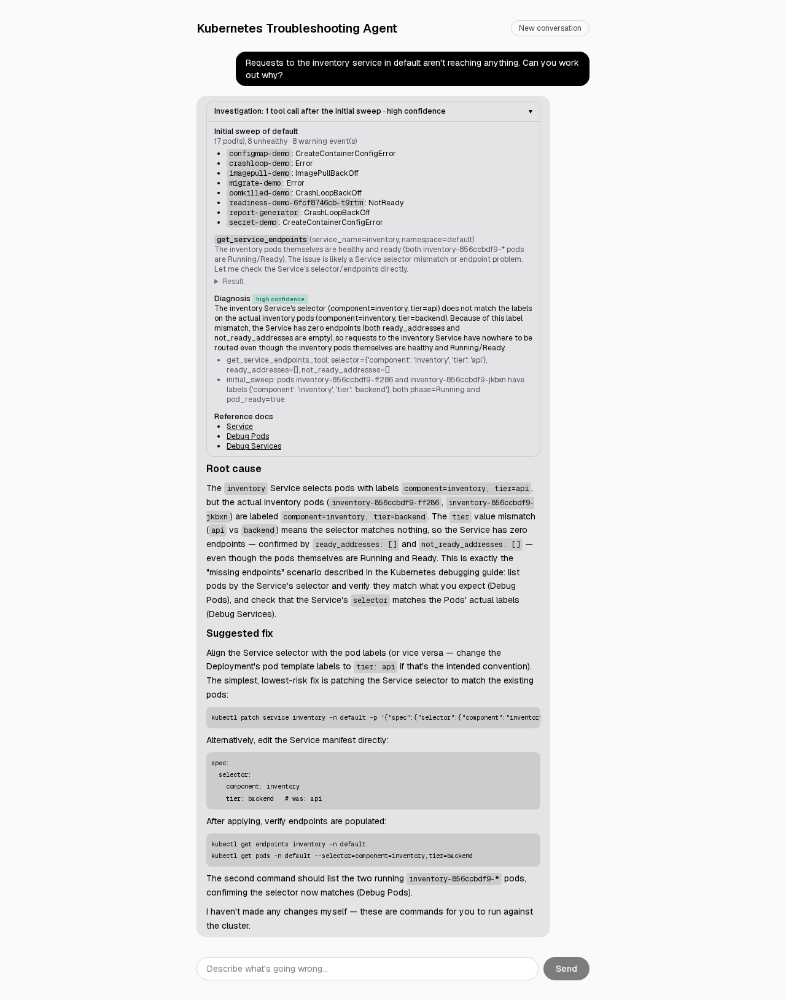
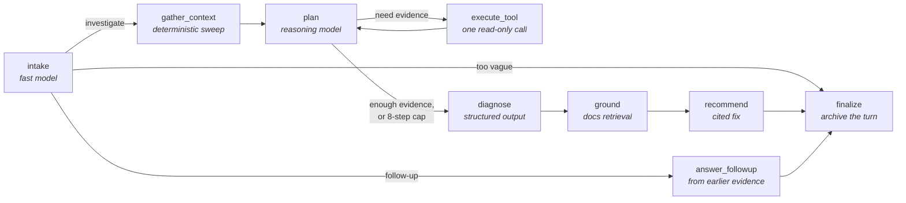

# Kubernetes Troubleshooting Agent

A LangGraph agent that diagnoses Kubernetes failures. It investigates a
cluster through read-only tools, reaches a root cause with a stated
confidence and the evidence behind it, and suggests a fix, citing the
official docs, for a human to run. It never changes the cluster.

It's measured, not just demoed: an eval harness breaks a real Kind
cluster in twenty known ways, asks the agent about each in plain
language, and scores the diagnosis against ground truth.



## Results

From the latest full eval run (2026-10-06, 21 scenarios, single run):

| | |
|---|---|
| **Root cause correct** | **19 / 21** (90%) |
| By tier | easy 4/4 · medium 4/4 · hard 11/13 |
| Planner tool calls per diagnosis | 2.3 on average (easy 0.8, hard 3.2), plus one deterministic sweep |
| Follow-up turns | 4 / 4 routed and answered correctly |
| Recommendations citing docs | 21 / 21; one cited URL was garbled (not a real page) |
| Ended in a clarifying question | 0 |

The two misses are built-to-fail cases, and they fail consistently:
`logtail` puts the cause in a single log line far above the 100-line tail
the agent reads by default, and `needle` hides one bad shard among
sixteen identical pods with an 8-step budget. Run to run, the score has
ranged from 16 to 19 out of 21.

## How it works



The design separates **fact-gathering**, which is deterministic Python
against the Kubernetes API, from **judgment**, which is the model. A few
decisions shape everything else (details in
[`docs/architecture.md`](docs/architecture.md)):

- **Read-only by construction.** The tools use the official `kubernetes`
  client and only ever call `list_*`/`read_*`/`get_*` methods. A test
  statically scans the tool layer and fails on any other client verb.
  Secrets and ConfigMaps come back as key names, never values.
- **Failed tool calls are evidence.** Asking for a Secret and getting a
  404 is how "the Secret doesn't exist" gets confirmed. Tool errors are
  normalized into facts the planner reasons about, never exceptions that
  kill the run. Eval found this the hard way (below).
- **A bounded loop.** The planner makes one tool call per round, capped
  at eight. At the cap, it diagnoses from what it has and says so,
  rather than looping or guessing confidently.
- **Two model tiers.** A fast model resolves what's being asked; a
  reasoning model plans, diagnoses, and writes the fix. Every node gets
  its model through one function, so a tier change is a one-line edit.
- **Memory with honest routing.** Conversations persist in a LangGraph
  checkpointer. A follow-up the earlier evidence already answers ("which
  key was it?") is answered without touching the cluster; a question
  about current state ("is it fixed now?") investigates again. A
  first-turn guard in code stops a misclassified question from skipping
  the investigation.

## Three ways to use it

**Web UI.** Chat with the agent and expand any answer to see how it got
there: the initial sweep, each tool call with the planner's reasoning and
the raw result, the diagnosis with its confidence, and the docs it cited.

**From Claude Code, or any MCP client.** The agent is exposed as a single
MCP tool, `investigate`, so it runs from the assistant you already use:

```bash
claude mcp add kube-troubleshooter -- uv run --directory "$PWD/backend" python -m mcp_server
```

It returns the structured diagnosis, the fix, and the full evidence
trail, and streams progress as it works. It deliberately exposes the
*agent* rather than the raw cluster tools: plenty of Kubernetes MCP
servers already give a model `kubectl`-style reads, and what this project
adds is the measured investigation on top.

**The eval harness.** See [Evaluation](#evaluation).

## Quickstart

You need a Kind cluster with something broken in it, an Anthropic API
key, and (for cited docs) a Voyage AI key.

```bash
kind create cluster --name kube-troubleshoot
kubectl apply -f infra/kubernetes/          # the demo failures, below
cp backend/.env.example backend/.env        # ANTHROPIC_API_KEY, VOYAGE_API_KEY
```

**With Docker** (backend, frontend, and a Qdrant of its own):

```bash
infra/docker/kubeconfig.sh                  # in-network kubeconfig for the container
docker compose -f infra/docker/compose.yaml up -d --build
docker compose -f infra/docker/compose.yaml run --rm backend python -m rag.index   # once, ~6 min on Voyage's free tier
```

**Or locally:**

```bash
docker run -d --name qdrant -p 6333:6333 -v qdrant_storage:/qdrant/storage qdrant/qdrant
cd backend && uv run python -m rag.index && uv run uvicorn api.main:app --port 8000
cd frontend && cp .env.local.example .env.local && npm install && npm run dev
```

Then open http://localhost:3000 and ask something like *"The secret-demo
pod in default won't start, why?"* Ports are bound to loopback only: the
API has no auth, and it runs with Kind's cluster-admin kubeconfig.

### The demo failures

`kubectl apply -f infra/kubernetes/` creates these in `default`:

| Manifest | What's broken |
|---|---|
| `crashloop-demo` | container exits 1 right after starting → `CrashLoopBackOff` |
| `imagepull-demo` | bogus image reference → `ImagePullBackOff` |
| `oomkilled-demo` | workload blows past its 50Mi limit → repeated `OOMKilled` |
| `readiness-demo` | readiness probe hits a 404 path, so the pod runs but never joins its Service |
| `secret-demo` | `secretKeyRef` to a Secret that doesn't exist → `CreateContainerConfigError` |
| `configmap-demo` | the ConfigMap exists but the referenced key is the wrong case |
| `dns-demo` | client calls `payments-api`; the Service is named `payments` |
| `networkpolicy-demo` | a policy admits only `app=allowed-client`, so the real client's packets are dropped |
| `selector-demo` | the Service selects `tier=frontend`; the pods are `tier=api` → zero endpoints |
| `distractor-demo` | the same selector bug, next to a loud, unrelated crashlooping pod |
| `initcontainer-demo` | an init container exits 1, so the pod never leaves `Init` |
| `web-demo` | a healthy nginx Deployment, as a control |

Several are quiet on purpose: in the DNS, NetworkPolicy, and selector
cases every pod is Running and Ready and no Warning event is ever
emitted, so the evidence is only in logs, policies, and label selectors.

## Evaluation

```bash
cd backend
uv run python -m eval                    # all 21 scenarios, ~23 min
uv run python -m eval -s dns -s secret   # a subset
```

Each scenario is a manifest plus a golden label: the true root cause and
the fix that actually resolves it. The harness applies it into a
throwaway namespace, waits until the failure is genuinely observable,
asks the agent a question that names the symptom but never the cause,
scores the answer, and tears the namespace down. An LLM judge owns the
verdict, since keyword matching can't tell a paraphrase from a miss. A
deterministic signal check runs alongside it to say *which* part of the
answer was missing, and disagreements between the two are reported, not
smoothed over.

Scenarios are tiered. The easy tier is a regression guard watching for
tool-call *inflation*. The hard tier holds the cases built to make the
agent fail: reasoning traps, answers buried past a truncated log tail,
a capability gap, and a step budget it can't fit inside. Some scenarios
also carry follow-up turns, scored on whether the agent answered from
memory or went back to the cluster, and whether the answer was right.

The full method, every scenario's purpose, and the history of runs are
in [`backend/eval/README.md`](backend/eval/README.md).

### What eval caught

The harness has paid for itself more than once:

- **Crashes that killed finished investigations.** A 404 escaping a tool
  call, an unreachable cluster during the sweep, a structured output
  missing a required field, a model reply arriving as a list of content
  blocks: each killed a run that had already gathered the evidence it
  needed. Hence the rule, now in the code and its tests, that no node
  raises on a recoverable condition.
- **A prompt that refused to investigate.** The first `intake` prompt
  turned answerable requests into clarifying questions, which ends the
  run with no diagnosis. It was rewritten.
- **Wrong-namespace tool calls.** The planner often omits `namespace`,
  so a call silently hit `default`, and the 404 read as "that doesn't
  exist". The executor now fills in the scope's namespace.
- **A tool gap behind a memory feature.** The first multi-turn baseline
  failed "which key was the pod reading?". Routing was right, and the
  agent honestly said it didn't know, because pod `describe` never
  returned env references. It does now; the follow-ups score 4/4.
- **Claims this project made about itself.** Three predictions about
  scenario difficulty were falsified by measurement, including one in
  this README's own history.

### What RAG turned out to be for

The original design made docs search a tool the planner could call. Eval
measured it calling that tool zero times. The cluster evidence settles
the diagnosis, and the public Kubernetes docs overlap with what the model
already knows. So retrieval moved to where it earns its keep: a
deterministic `ground` step fetches docs for the diagnosed cause, and the
recommendation cites them. That's written up as a finding rather than
papered over with a scenario rigged to need RAG
([`backend/eval/README.md`](backend/eval/README.md)).

## Engineering

- **Tests:** `cd backend && uv run pytest` (about 1 second, with no
  cluster, model, or network). They cover tool normalization against real
  `kubernetes.client` objects, the read-only boundary, state resets, the
  graph and API over stubbed model nodes, the MCP tool, and eval scoring.
  The frontend's stream parser has its own tests (`npm test`). Lint is
  `uv run ruff check .`.
- **Logs:** structured JSON lines with `request_id`, `thread_id`, and
  `trace_id`: turn duration and route, per-node timing, each tool call's
  latency and error. User text is logged by length only.
- **Tracing:** LangSmith, env-gated. Each conversation is one LangSmith
  thread, each turn's root run id is logged, and eval traces to its own
  project so it never mixes with real traffic.
- **Docker:** a two-stage backend image (non-root, no build tooling at
  runtime) and a standalone Next.js image. Compose attaches the backend
  to Kind's network so it can reach the cluster.

## Limits, stated plainly

- **Credentials.** Read-only is enforced in code and by test, but the
  agent runs with whatever the kubeconfig grants, which on Kind is
  cluster-admin. A read-only RBAC ServiceAccount would make the boundary
  hold at the cluster too; it isn't built.
- **No auth.** It's a local tool. The API and UI bind to loopback.
- **Variance.** It's a model-driven agent: the same question can take a
  different path. In one run it inspected the Secret instead of the pod,
  never saw which key was referenced, and guessed. Eval numbers come
  from single runs, and results move by a scenario or two between runs.
- **The planner doesn't always explain itself.** The trail shows the
  planner's reasoning for each tool call when it gives some, and
  sometimes it doesn't.
- **An explicit "go check" can be answered from memory.** If earlier
  evidence already covers it, a request to check again is routed as a
  follow-up and answered from that evidence (correctly, but without the
  re-check the user asked for). It's visible in the
  [demo walkthrough](demo/README.md) rather than scripted around.

## Repository

```text
backend/
  api/            FastAPI: SSE chat stream, thread rehydration, trail serializer
  agent/          graph node functions
  graph/          state, graph assembly, loop guard
  tools/          read-only Kubernetes tools + normalization
  rag/            docs corpus, Voyage embeddings, Qdrant retrieval
  prompts/        versioned prompts, one per node
  models/         model tier routing
  mcp_server/     the `investigate` MCP tool
  observability/  structured logging, tracing setup
  eval/           scenarios, golden labels, harness, scorers
  tests/
frontend/         Next.js chat UI with the investigation trail
infra/
  kubernetes/     failure-scenario manifests (demo + eval-only)
  docker/         Dockerfiles, compose stack
docs/
  architecture.md
demo/             walkthrough script + a Playwright recorder that drives the real UI
```

Built with LangGraph, LangChain (model wrapper and RAG plumbing only),
Claude, FastAPI, Qdrant, Voyage AI, Next.js, Kind, LangSmith, and the MCP
Python SDK.
